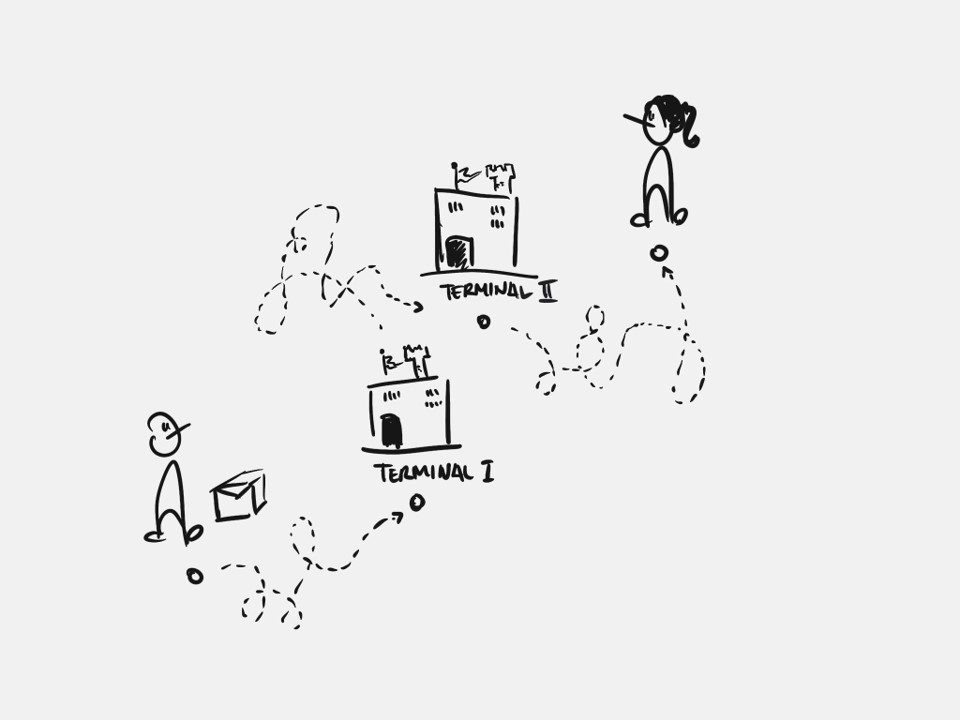

# Posten Use Case

Use case for Posten Second Round Interviews.


## Introduction

Here we describe two small use cases that the candidate can present at their next interview session. In the first one we want to estimate delivery hours for shipments and in the second one we are interested in volume forecasting for postal areas. For each exercise a data set is provided along with some intructions. The objective is for the candidate to make their own attempt at the problem statements.

When arriving at the next interview please be ready to present your solutions. Please also prepare for some discussions around how your solution is set into production and monitored later.


## Data

### Access

Both exercises share the same data set, which is too large to include in this repository. You will therefore need to download it from our datalake. Within Azure we have a storage account called `ekofiskpublic` that contains a storage container with name `misc`. Within this container the data set is located at `sample_data.parq`.

To access data sets in Azure one writes URLs on the format: `https://<storage-account>.blob.core.windows.net/<container>/<filename>`.

:bulb: The file is stored in parquet format which can be seen as a compressed version of CSV. If working with python you can use `pandas.read_parquet` function to read the data set.

### Description

Below is an image that describes a simplified view of our production flow for shipments. Shipments are sent from a recipient and recieved at a first terminal. From there they are relayed to a second terminal, often called a *distribution terminal*, from where it is later loaded to distribution and delivered at the recipient.



The provided data set contains the following information:

```
 #   Column                Dtype           Description
---  ------                -----           -----------
 0   from_postal_code      category        Sender postal code
 1   to_postal_code        category        Recipient postal code
 2   weight                int32           Weight of package in grams
 3   length                int32           Length of package in cm
 4   width                 int32           Width of package in cm
 5   height                int32           Height of package in cm
 6   t1_timestamp          datetime64[ns]  Time the package arrived at the first terminal
 7   t1_postal_code        category        Postal code of the first terminal
 8   t2_postal_code        category        Postal code of the second terminal
 9   t2_timestamp          datetime64[ns]  Time the package arrived at the second terminal
 10  delivery_timestamp    datetime64[ns]  Time of delivery scan
 11  delivery_event_lat    float32         Latitude of delivery scan
 12  delivery_event_lon    float32         Longitude of delivery scan
 13  product_id            int32           Product identifier
```

In it contains roughly six months of data for four different products.


## Exercises

Below we describe in detail the problem statement behind each exercise.
:warning: Do not spend too much time on getting the best results! We are more interested in discussing the thought process behind your solution.


### Delivery Hours

Customers are tired of hearing that we will deliver between 08:00 and 16:00, they need to plan their day as well. Our objective here is to estimate what time of the day we will deliver a certain package. Ideally we want to communicate a time window that is as small as possible to the recipient when they can expect it.


### Volume Forecasting

We also need to plan for the coming volume that we are going to distribute preferably by postal code. We need to know daily volumes up to two weeks in advance. Using the recieved data try and make two week forecasts of the daily volume per postal code.


GLHF!!
